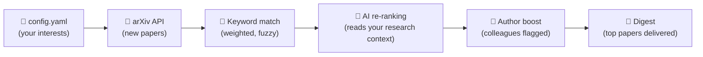

# 🔭 arXiv Digest

**Your personal arXiv paper curator** — fetches new papers, scores them against your research, and delivers a digest to your inbox.


Created by [Silke S. Dainese](https://silkedainese.github.io) · [dainese@phys.au.dk](mailto:dainese@phys.au.dk) · [ORCID](https://orcid.org/0009-0001-7885-2439)

I built this for myself — I am a PhD student in astronomy at Aarhus University and I wanted a smarter way to stay on top of new papers. Other people found it useful, so I made it public. It works for anyone on arXiv.

> **For students:** The setup wizard has a simpler astronomy path with pre-built interest packages. If you want something similar for your field, [write me](mailto:dainese@phys.au.dk).

---

## Quick Start

Three steps. No terminal needed.

> [!TIP]
> ### Step 1 — Describe your research
> **[Open the config page →](https://arxiv-digest-setup.streamlit.app)**
>
> Fill in your name, research interests, keywords, and email address. The page generates a config file — download it.

> [!NOTE]
> ### Step 2 — Get your own copy
> **[Fork this repo →](https://github.com/SilkeDainese/arxiv-digest/fork)**
>
> This creates your personal copy on GitHub. Everything runs there — nothing is shared back.

> [!IMPORTANT]
> ### Step 3 — Connect and launch
>
> **Upload your config:**
> **Add file → Upload files** → drag in the config file → **Commit changes**
>
> **Add your secrets:**
> **Settings → Secrets and variables → Actions**
> &ensp; → **New repository secret** → name: `RECIPIENT_EMAIL`, value: your email address
> &ensp; → **New repository secret** → name: `DIGEST_RELAY_TOKEN`, value: the token from the config page
>
> **Start the first run:**
> **Actions** tab → enable workflows → **arXiv Digest** → **Run workflow**

**That's it.** Your digest now runs automatically **Mon/Wed/Fri at 9am Danish time**. Papers show up in your inbox — no further action needed.

> [!NOTE]
> **No invite code?** You can send from your own email instead — add `SMTP_USER` and `SMTP_PASSWORD` ([Gmail App Password →](https://myaccount.google.com/apppasswords)) as secrets instead of the relay token.

<details>
<summary>Prefer a terminal flow?</summary>

Run `python -m scripts.friend_setup` from a checkout of this repo. It opens the config page, waits for the file in Downloads, forks the repo, uploads the config, and enables Actions.

</details>

---

> **Do I need an API key?** No — keyword scoring works without any key. Add one later if you want smarter ranking.

> **Can I change the schedule?** Yes — edit the cron line in `.github/workflows/digest.yml`.

> **Can I run it locally?** `python digest.py --preview` renders a digest in your browser without sending email.

> **How do I pause or unsubscribe?** Disable the workflow or delete the fork — see [Managing Your Digest](#managing-your-digest).

> **How do I give feedback on papers?** Click the ↑/↓ arrows on each card. Future digests learn from your votes.

---

## How Scoring Works

You describe your research in `config.yaml` — your keywords, your field, a free-text description of what you work on, and optionally your collaborators. The digest uses that profile to score every new arXiv paper in three steps:



1. **Keyword matching** — your keywords vs. each paper's title and abstract, weighted 1–10. Fuzzy: `planet` matches `planetary`.
2. **AI re-ranking** — reads your free-text research description and re-ranks by *actual relevance*, not just term overlap. The more specific your description, the better.
3. **Author boost** — papers by your collaborators get bumped. Papers you authored get a celebration section.

**What if AI is unavailable?** The system cascades automatically:

| Tier | Provider | What happens |
|------|----------|--------------|
| 1 | **Claude** (Anthropic) | Used if you add `ANTHROPIC_API_KEY` |
| 2 | **Gemini** (Google) | Used if you add `GEMINI_API_KEY` |
| 3 | **Keywords only** | Always works — no key needed |

If one tier fails, the next takes over. You always get a digest.

**Feedback loop.** When you click ↑/↓ on a paper card, it creates a GitHub issue that the next run ingests. Upvoted keywords get a scoring boost; downvoted ones get dampened. The system learns what you care about over time.

---

## Optional Upgrades

| Upgrade | What it does | How |
|---------|--------------|-----|
| **AI scoring** | Smarter paper ranking | Add `GEMINI_API_KEY` ([free →](https://aistudio.google.com/apikey)) or `ANTHROPIC_API_KEY` as a repo secret |
| **Feedback arrows** | ↑/↓ buttons to improve future scoring | Set `github_repo` in your config.yaml |
| **Keyword tracking** | See which keywords match over time | **Settings → Actions → Workflow permissions** → "Read and write" |

---

<details>
<summary><strong>Config Reference</strong></summary>

See [`config.example.yaml`](config.example.yaml) for all options with inline comments.

| Field | Description |
|-------|-------------|
| `research_context` | Free-text description of your research (used by AI scoring) — the more specific, the better |
| `keywords` | Dictionary of `keyword: weight` pairs (1–10) |
| `keyword_aliases` | Optional `keyword: [similar phrases]` overrides for brittle terminology |
| `categories` | arXiv categories to monitor |
| `self_match` | How your name appears in arXiv author lists — triggers a celebration section when you publish |
| `research_authors` | Authors whose papers get a relevance boost |
| `colleagues` | People/institutions whose papers always show; people can carry an optional `note` shown in the digest |
| `digest_mode` | `highlights` (fewer, higher-quality picks) or `in_depth` (wider net, more papers) |
| `recipient_view_mode` | `deep_read` (full cards) or `5_min_skim` (top 3 one-line summaries) |
| `github_repo` | Your fork's path, e.g. `janedoe/arxiv-digest` — enables feedback arrows and self-service links |
| `setup_url` | Optional override for the "Re-run setup wizard" footer link |

</details>

<details>
<summary><strong>Managing Your Digest</strong></summary>

Every digest email includes self-service links at the bottom:

- **Edit interests** → opens `config.yaml` in GitHub's web editor
- **Pause** → links to the Actions tab (disable the workflow)
- **Re-run setup** → opens the setup wizard
- **Delete** → links to repo Settings (Danger Zone → Delete repository)

Each paper card includes feedback arrows when `github_repo` is set:

- **↑** = relevant (more like this)
- **↓** = not relevant (less like this)

**To unsubscribe:** Disable the workflow (pause) or delete the fork (permanent).

</details>

---

## Development

```bash
pip install -r requirements.txt
python digest.py --preview        # renders in browser, no email
python digest.py                  # full run (needs RECIPIENT_EMAIL + email secrets)
cd setup && streamlit run app.py  # run the setup wizard locally
```

Outlook users: set `smtp_server: "smtp.office365.com"` in config.yaml. Maintainers: see [CONTRIBUTING.md](CONTRIBUTING.md) for invite code setup.

---

## License

MIT — see [LICENSE](LICENSE).

**Created by [Silke S. Dainese](https://silkedainese.github.io)** · Aarhus University · Dept. of Physics & Astronomy
